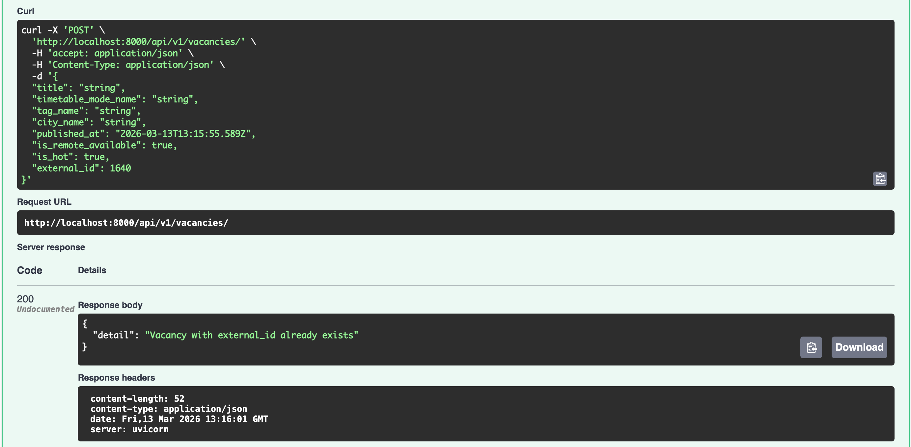
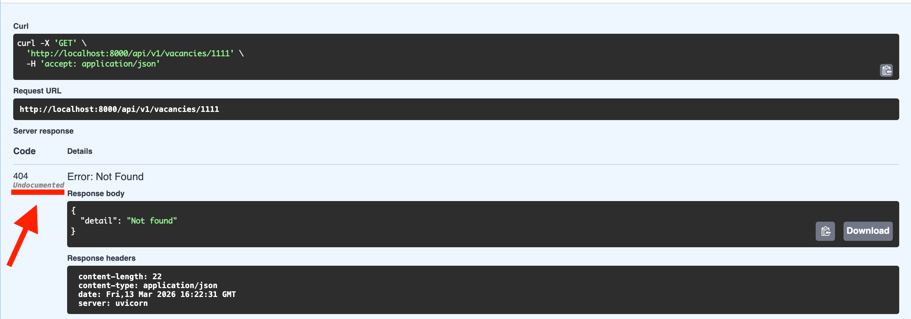
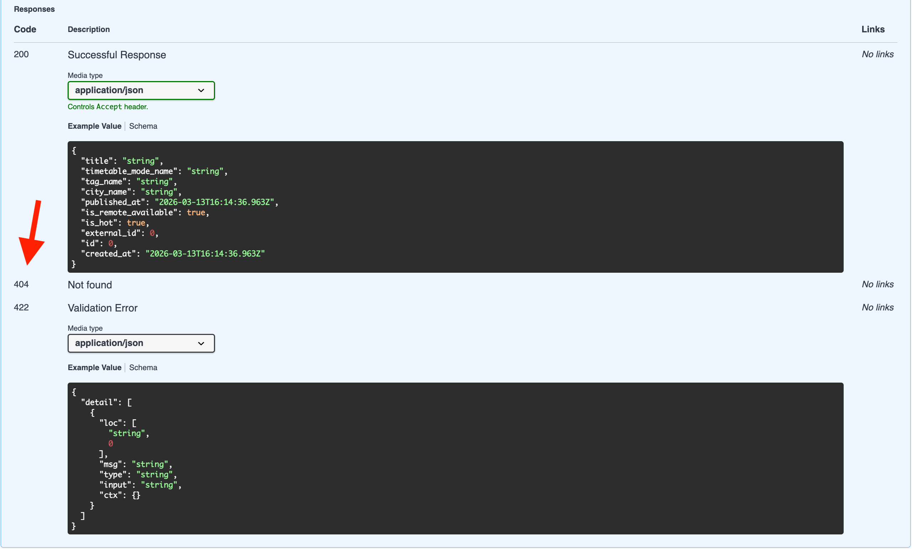

Отчёт по отладке приложения Володченко Вадим Вячеславович


---
## БАГ 1
* Проблема: После окончания build контейнеров, контейнер с приложением не запустился из-за `ValidationError` (1 validation error for Settings)

<details>
<summary>лог ошибки (нажмите чтобы открыть)</summary>

```
File "/app/alembic/env.py", line 8, in <module>
    from app.core.config import settings
  File "/app/app/core/config.py", line 20, in <module>
    settings = Settings()
               ^^^^^^^^^^
  File "/usr/local/lib/python3.11/site-packages/pydantic_settings/main.py", line 242, in __init__
    super().__init__(**__pydantic_self__.__class__._settings_build_values(sources, init_kwargs))
  File "/usr/local/lib/python3.11/site-packages/pydantic/main.py", line 250, in __init__
    validated_self = self.__pydantic_validator__.validate_python(data, self_instance=self)
                     ^^^^^^^^^^^^^^^^^^^^^^^^^^^^^^^^^^^^^^^^^^^^^^^^^^^^^^^^^^^^^^^^^^^^^
pydantic_core._pydantic_core.ValidationError: 1 validation error for Settings
database_url
  Extra inputs are not permitted [type=extra_forbidden, input_value='postgresql+asyncpg://pos...stgres@db:5432/postgres', input_type=str]
For further information visit https://errors.pydantic.dev/2.12/v/extra_forbidden
```

</details>

* Проблема: неправильно настроено получение переменных окружения программой
* Файл и строки: `app/core/config.py:14`

```
# Код до
validation_alias="DATABSE_URL",         
```

```
# Код после
validation_alias="DATABASE_URL",         
```
* Причина: по умолчанию `Settings` из `app/core/config.py` допускает только переменные окружения, которые называются так же как атрибуты `Settings`. А из-за неправильного `validation_alias="DATABSE_URL"` при инициализации `Settings` программа воспринимает переменную `DATABASE_URL` из `.env` как не соответствующую разрешенным атрибутам и выдает ошибку. Поэтому нужно исправить `validation_alias`, чтобы он соответствал названию переменной окружения.
> Extra inputs are not permitted [type=extra_forbidden, input_value='postgresql+asyncpg://pos...stgres@db:5432/postgres', input_type=str]
---

### БАГ 2
* Описание проблемы: в проекте много hard-coded значений и ссылок:
1) в `docker-compose.yml:7-9` в контейнере `db` имя пользователя, пароль и название БД:

```
# Код до
      POSTGRES_USER: postgres
      POSTGRES_PASSWORD: postgres
      POSTGRES_DB: postgres
```
* Укажем в `docker-compose.yml` в контейнере `db` файл `.env`:
```
# Код после
db:
    image: postgres:16
    env_file:
        - .env
```
2) в `Settings` из `app/core/config.py` в атрибуте `database_url` по умолчанию указан неправильный url базы данных (неправильное название БД):
* Файл и строки: `app/core/config.py:13`
```
# Код до
database_url: str = Field(
    "postgresql+asyncpg://postgres:postgres@db:5432/postgres_typo",      
```
* Уберем url по умолчанию (он должен быть получен из переменной окружения):
```
# Код после
database_url: str = Field(
    validation_alias="DATABASE_URL",
)      
```
3) в `app/services/parser.py:13` прописано `API_URL`:
```
# Код до
API_URL = "https://api.selectel.ru/proxy/public/employee/api/public/vacancies"     
```
* Переместим его в `.env`, а в `app/services/parser.py` получим значение из `settings`:
```
# Код после
API_URL = settings.api_url
```
* Объяснение: перемещение этих значений в переменные окружения повысит безопасность в случае с паролями от БД, а также избавит от необходимости менять код в случае, если поменяется API_URL
* Итоговый вид `Settings` из `app/core/config.py`:
```
class Settings(BaseSettings):
    model_config = SettingsConfigDict(
        env_file=".env",
        env_file_encoding="utf-8",
        case_sensitive=False,
    )

    database_url: str = Field(
        validation_alias="DATABASE_URL",         
    )
    log_level: str = "INFO"
    parse_schedule_minutes: int = 5

    postgres_user: str 
    postgres_password: str
    postgres_db: str

    api_url: str    
```
* Итоговый вид `.env`:
```
DATABASE_URL=postgresql+asyncpg://postgres:postgres@db:5432/postgres
LOG_LEVEL=INFO
PARSE_SCHEDULE_MINUTES=5

POSTGRES_USER=postgres
POSTGRES_PASSWORD=postgres
POSTGRES_DB=postgres

API_URL="https://api.selectel.ru/proxy/public/employee/api/public/vacancies"
```
---

## БАГ 3
* Проблема: после запуска контейнеров при каждой попытке парсинга в логах контейнера с приложением видим ошибку `AttributeError` (Ошибка фонового парсинга: 'NoneType' object has no attribute 'name')

<details>
<summary>лог ошибки (нажмите чтобы открыть)</summary>

```
  File "/app/app/main.py", line 24, in _run_parse_job
    await parse_and_store(session)
  File "/app/app/services/parser.py", line 43, in parse_and_store
    "city_name": item.city.name.strip(),
                 ^^^^^^^^^^^^^^
AttributeError: 'NoneType' object has no attribute 'name'
2026-03-12 18:54:05,124 | INFO | apscheduler.executors.default | Job "_run_parse_job (trigger: interval[0:00:05], next run at: 2026-03-12 18:54:08 UTC)" executed successfully
2026-03-12 18:54:08,646 | INFO | apscheduler.executors.default | Running job "_run_parse_job (trigger: interval[0:00:05], next run at: 2026-03-12 18:54:13 UTC)" (scheduled at 2026-03-12 18:54:08.640157+00:00)
2026-03-12 18:54:08,647 | INFO | app.services.parser | Старт парсинга вакансий
2026-03-12 18:54:10,238 | INFO | httpx | HTTP Request: GET https://api.selectel.ru/proxy/public/employee/api/public/vacancies?per_page=1000&page=1 "HTTP/1.1 200 OK"
2026-03-12 18:54:10,240 | ERROR | app.main | Ошибка фонового парсинга: 'NoneType' object has no attribute 'name'
Traceback (most recent call last):
  File "/app/app/main.py", line 24, in _run_parse_job
    await parse_and_store(session)
  File "/app/app/services/parser.py", line 43, in parse_and_store
    "city_name": item.city.name.strip(),
                 ^^^^^^^^^^^^^^
AttributeError: 'NoneType' object has no attribute 'name'
2026-03-12 18:54:10,241 | INFO | apscheduler.executors.default | Job "_run_parse_job (trigger: interval[0:00:05], next run at: 2026-03-12 18:54:13 UTC)" executed successfully
```

</details>

* Файл и строка: `app/services/parser.py:43`

```
# Код до
"city_name": item.city.name.strip(),         
```

```
# Код после
"city_name": item.city.name.strip() if item.city and item.city.name else None,       
```
* Причина: не была выполнена проверка на `None` в ключе `city` после парсинга. Отдельно стоит отметить, что и в SQLAlchemy-модели `app/models/vanancy.py`, и в схемах Pydantic `app/schemas/vanancy.py` для поля `city` предусмотрена возможность значений null. Поэтому если в полученном JSON с вакансиями в ключе `city` указано null, то можно положить в соответствующее поле `None` и добавленной проверки будет достаточно.


---

## БАГ 4
* Проблема: после запуска контейнеров парсинг производится каждые 5 секунд, а не каждые пять минут

<details>
<summary>лог парсинга (нажмите чтобы открыть)</summary>

```
2026-03-12 19:23:35,099 | INFO | apscheduler.executors.default | Running job "_run_parse_job (trigger: interval[0:00:05], next run at: 2026-03-12 19:23:40 UTC)" (scheduled at 2026-03-12 19:23:35.094120+00:00)
2026-03-12 19:23:35,100 | INFO | app.services.parser | Старт парсинга вакансий
<...>
2026-03-12 19:23:40,099 | INFO | apscheduler.executors.default | Running job "_run_parse_job (trigger: interval[0:00:05], next run at: 2026-03-12 19:23:45 UTC)" (scheduled at 2026-03-12 19:23:40.094120+00:00)
2026-03-12 19:23:40,099 | INFO | app.services.parser | Старт парсинга вакансий
<...>
2026-03-12 19:23:45,096 | INFO | apscheduler.executors.default | Running job "_run_parse_job (trigger: interval[0:00:05], next run at: 2026-03-12 19:23:50 UTC)" (scheduled at 2026-03-12 19:23:45.094120+00:00)
2026-03-12 19:23:45,096 | INFO | app.services.parser | Старт парсинга вакансий
```

</details>

* Файл и строка: `app/services/scheduler.py:13`
```
# Код до
seconds=settings.parse_schedule_minutes,        
```

```
# Код после
minutes=settings.parse_schedule_minutes,     
```
* Причина: при добавлении job в scheduler в методе `add_job` используется параметр `seconds`, а в качестве значения передается выраженное в минутах значение переменной окружения `settings.parse_schedule_minutes`. Поэтому нужно поменять параметр на `minutes`.
> для справки: по документации `apscheduler`, параметры `seconds` и `minutes` не относятся к сигнатуре метода `add_job`, и передаются через `**kwargs` в триггер: https://apscheduler.readthedocs.io/en/3.x/modules/schedulers/base.html#apscheduler.schedulers.base.BaseScheduler.add_job
---

## БАГ 5
* Проблема: после выполнения запроса через `httpx` и завершения парсинга `httpx.AsyncClient` не закрывается, что может приводить к утечке соединений

* Файл и строки: `app/services/parser.py:30-31`
```
# Код до
try:
    client = httpx.AsyncClient(timeout=timeout)    
```

```
# Код после
async with httpx.AsyncClient(timeout=timeout) as client:
    try:  
```
* Объяснение: для нормального закрытия клиента `httpx` необходимо либо обернуть его в асинхронный менеджер контекста `async with`, либо явно вызвать `await client.aclose()`
> источник: https://www.python-httpx.org/async/#opening-and-closing-clients
---

## БАГ 6
* Проблема: при POST-запросе на `/api/v1/vacancies` с уже существующим в базе данных `external_id` в теле запроса Swagger UI возвращает некорректный и неинформативный статус 200 (смотри скриншот)

* Файл и строки: `app/api/v1/vacancies.py:45, 51-55`

```
# Код до
@router.post("/", response_model=VacancyRead, status_code=status.HTTP_201_CREATED)   
<...>
    if existing:
        return JSONResponse(
            status_code=status.HTTP_200_OK,
            content={"detail": "Vacancy with external_id already exists"},
        )
```

```
# Код после
@router.post("/", response_model=VacancyRead, status_code=status.HTTP_201_CREATED)   
<...>
    if existing:
        raise HTTPException(
            status_code=status.HTTP_409_CONFLICT,
            detail="Vacancy with external_id already exists",
        )
```
* Объяснение: когда при POST-запросе производится попытка создать уже существующий ресурс, более информативно и правильно с точки зрения канонов HTTP будет вернуть ошибку с кодом 409
---

## БАГ 7
* Проблема: не все возможные ответы API-эндпоинтов задокументированы в Swagger UI. Например, при GET-запросе на `/api/v1/vacancies/{vacancy_id}` с несуществующим в базе данных `id` API возвращает 404, но такой ответ не задокументирован в Swagger:

* Решение: добавим параметр `responses` в декоратор эндпоинта и укажем в нем дополнительный возможный ответ
* Файл и строки: `app/api/v1/vacancies.py:35`

```
# Код до:
@router.get("/{vacancy_id}", response_model=VacancyRead)
```

```
# Код после:
@router.get("/{vacancy_id}", response_model=VacancyRead, responses={
        404: {"description": "Not found"},
    },)
```
* Объяснение: теперь все возможные ответы эндпоинта правильно задокументированы в Swagger (аналогичные изменения можно внести для всех остальных эндпоинтов). 

---


## Дополнительно
> описанные проблемы не нарушают работу программы, но тоже могут быть важны в особых случаях 

### 1 
* после запуска `docker-compose up --build` получил предупреждение об устаревшем атрибуте `version` в `docker-compose.yml`
>WARN[0000] /Users/vadimv/code/selectest-api/docker-compose.yml: the attribute `version` is obsolete, it will be ignored, please remove it to avoid potential confusion 
* решение - можно просто убрать первую строку `version: "3.9"` из `docker-compose.yml`

### 2
* в `app/main.py:29-42` используются устаревшие по документации `FastAPI` event handlers, выполняющие действия при запуске/остановке программы. `FastAPI` рекомендует использовать параметр `lifespan` при инициализации `app = FastAPI`
```
# Код до:
@app.on_event("startup")
<...>
@app.on_event("shutdown")
<...>
```

```
# Код после:
from comtextlib import asynccontextmanager
<...>
@asynccontextmanager
async def lifespan(app: FastAPI):

    logger.info("Запуск приложения")
    await _run_parse_job()

    scheduler = create_scheduler(parse_and_store)
    scheduler.start()
    
    yield

    logger.info("Остановка приложения")
    scheduler.shutdown(wait=False)
    
app = FastAPI(title="Selectel Vacancies API", lifespan=lifespan)
```
* важно: использование `lifespan` позволяет обойтись без использования глобальной переменной `_scheduler` в `app/main.py` и в принципе упрощает структуру программы

### 3 
* избыточный алиас в `Pydantic` схеме `ExternalVacanciesResponse` в `app/schemas/external.py:35`
```
# Код до:
item_count: int = Field(alias="item_count") 
```

```
# Код после:
item_count: int
```

### 4
* в параметрах эндпоинтов в `app/api/v1` сессию БД по документации `FastAPI` рекомендуется передавать через `Annotated` dependency (на примере POST-эндпоинта `/app/api/v1/parse`):
```
# Код до:
async def get_session() -> AsyncSession:
    async with async_session_maker() as session:
        yield session


@router.post("/")
async def parse_endpoint(session: AsyncSession = Depends(get_session)) -> dict:
```

```
# Код после:
async def get_session() -> AsyncSession:
    async with async_session_maker() as session:
        yield session

SessionDep = Annotated[AsyncSession, Depends(get_session)]

@router.post("/")
async def parse_endpoint(session: SessionDep) -> dict:
```
* обеспечивает более чистую сигнатуру эндпоинта (другие эндпоинты меняются аналогично)

### 5
* `fastapi==999.0.0; python_version < "3.8"` в `requirements.txt` - это рабочее решение для получения ошибки, если проект запускается на слишком старой версии python, но можно было сделать более явно через pyproject.toml:
```
# pyproject.toml
[project]
name = "your-project"
version = "0.1.0"
requires-python = ">=3.8"
```
* в случае с контейнерами это неважно, так как `FROM python:3.11-slim` в `Dockerfile` автоматически обеспечивает подходящую версию
   
### 6
* можно добавить логирование:
   - для CRUD-операций с БД в `app/crud/vacancy.py` с помощью `logger`
   - для API-эндпоинтов с попомщью `middleware` из `FastAPI` - может быть актуально для более детальных логов (по умолчанию `uvicorn` уже логирует вызовы эндпоинтов)

### 7
* для ускорения работы с БД можно добавить индекс на столбец `external_id` в модели `SQLAlchemy`, ведь по этому полю идёт поиск в `get_vacancy_by_external_id` и в `upsert_external_vacancies` в `app/crud/vacancy.py`:
* Файл и строки: `app/models/vacancy.py:26`

```
# Код до:
external_id: Mapped[int | None] = mapped_column(Integer, nullable=True)
```

```
# Код после:
external_id: Mapped[int | None] = mapped_column(
    Integer,
    nullable=True,
    index=True
)
```
> для применения изменений в модель `SQLAlchemy` надо будет создать новую миграцию `Alembic`

### 8
* в `upsert_external_vacancies` в `app/crud/vacancy.py:70-72` незначительная семантическая ошибка, вместо пустого словаря должно быть создано пустое множество:
```
# Код до:
    existing_ids = set(existing_result.scalars().all())
else:
    existing_ids = {} 
```

```
# Код после:
    existing_ids = set(existing_result.scalars().all())
else:
    existing_ids = set()
)
```

---
## Итог
* `docker` контейнеры запускаются и работают нормально
* утечки подключений в клиенте `httpx` в коде исправлены
* устранены hard coded значения и оптимизировано использование переменных окружения
* исправлены ошибки валидации после парсинга
* исправлен интервал фонового парсера
* эндпоинты работают корректно и возвращают правильные коды ответов
* приложен скриншоты Swagger UI с выполненными успешными запросами и обновленной документацией с учетом новых кодов ответов
* предложены изменения для устранения deprecated кода в соответствии с документацией `FastAPI` и др.
* предложены оптимизации для ускорения работы с БД

